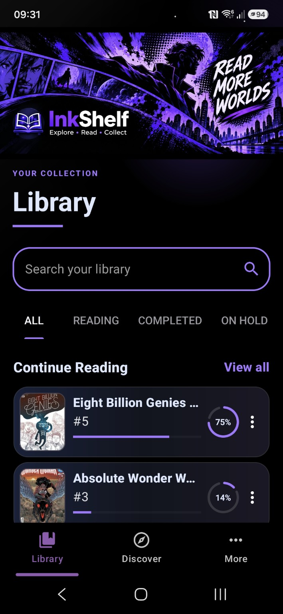
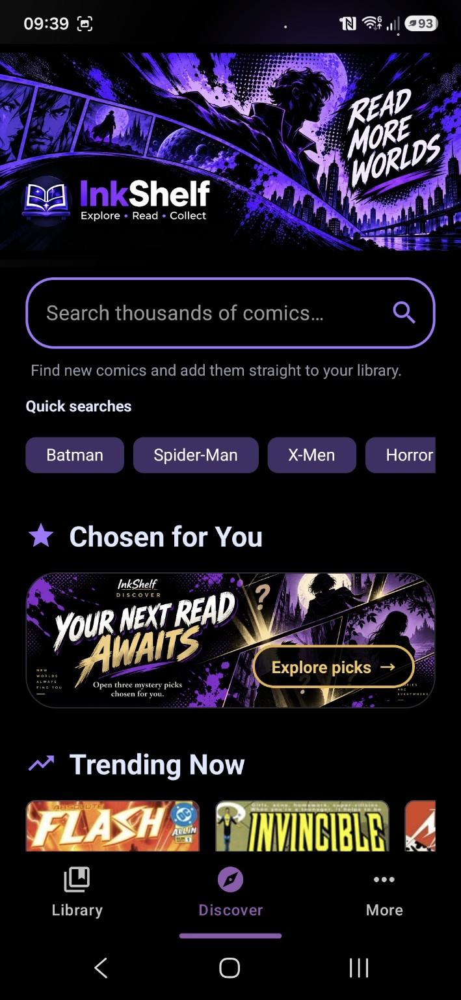
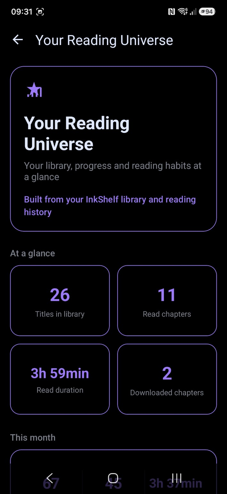
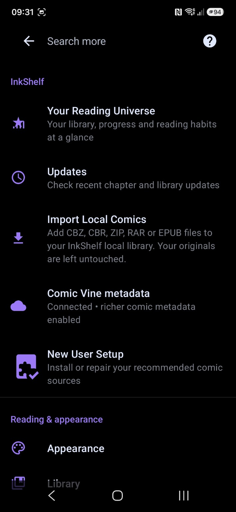

# InkShelf

**InkShelf** is an Android comic and manga reader built as a custom fork of [TachiyomiJ2K](https://github.com/Jays2Kings/tachiyomiJ2K).

The project keeps the proven J2K reader, library, source/extension, download, backup and tracking foundations while building a more comic-focused InkShelf experience on top.

> InkShelf is under active development. Some features are intentionally marked **BETA**.

## Highlights

- **Comic-focused Library** with reading-status tabs, pinned search and Continue Reading.
- **Discover** with recommendations, trending titles, new releases and background caching.
- **Your Reading Universe** with real reading-history and library statistics.
- **Panel Flow &mdash; BETA**: optional guided reading for Western/LTR comics.
  - Uses on-device OCR.
  - Moves through recognised dialogue while keeping artwork context visible.
  - Groups busy dialogue areas into readable stops.
  - Shows the full page before page transitions so artwork is not skipped.
- Multiple reader modes and reading directions.
- Downloads and offline reading.
- Local backups and restore.
- Source/extension support inherited from the Tachiyomi/Mihon ecosystem.
- Tablet, foldable and landscape support.

## Panel Flow &mdash; BETA

Panel Flow is an optional guided-reading mode designed primarily for Western left-to-right comics.

It uses bundled **on-device text recognition** to find dialogue and guide the reader through a page. Detection is not perfect, which is why the feature remains marked **BETA**.

Panel Flow does not require a cloud OCR service.

## Privacy

InkShelf does not include the upstream TachiyomiJ2K Firebase configuration.

The current project does not include Firebase Analytics or Firebase Crashlytics. Panel Flow text recognition runs on-device.

## Content and sources

InkShelf does **not** host, provide or distribute copyrighted comic or manga content.

Sources/extensions are separate from the app. Requests or problems relating to third-party sources should be handled by the relevant extension/source project rather than this repository.

## Building

### Requirements

- JDK 17
- Android SDK / Android Studio
- Git

### Windows

```powershell
git clone <your-repository-url>
cd InkShelf

$env:JAVA_HOME="PATH_TO_JDK_17"
.\gradlew.bat :app:assembleDevDebug -x :app:formatKotlinMain
```

### Linux / macOS

```bash
git clone <your-repository-url>
cd InkShelf

./gradlew :app:assembleDevDebug -x :app:formatKotlinMain
```

Debug APKs are produced under:

```text
app/build/outputs/apk/
```

## Contributing

Bug reports and focused improvements are welcome. Please read [`.github/CONTRIBUTING.md`](.github/CONTRIBUTING.md) before opening an issue.

For InkShelf-specific bugs, include:

- InkShelf version/build
- Android version
- device/model
- clear reproduction steps
- screenshots or logs where useful

## Upstream and attribution

InkShelf is a derivative work based on **TachiyomiJ2K** by Jays2Kings, which itself descends from the original **Tachiyomi** project by Javier Tomás and contributors.

The wider Tachiyomi ecosystem is now continued by projects including [Mihon](https://github.com/mihonapp/mihon).

InkShelf retains upstream copyright, licence and attribution notices as required.

## Licence

Licensed under the **Apache License 2.0**. See [LICENSE](LICENSE).

## Disclaimer

InkShelf is not affiliated with or endorsed by content providers, publishers, TachiyomiJ2K, Mihon, or third-party extension developers.

Users are responsible for complying with the laws and terms applicable to the content and sources they choose to access.

<!-- INKSHELF_SCREENSHOTS_START -->
## Screenshots

<table>
  <tr>
    <td align="center">
      <br>
      <b>Library</b>
    </td>
    <td align="center">
      <br>
      <b>Discover</b>
    </td>
  </tr>
  <tr>
    <td align="center">
      <br>
      <b>Reading Universe</b>
    </td>
    <td align="center">
      <br>
      <b>More</b>
    </td>
  </tr>
</table>
<!-- INKSHELF_SCREENSHOTS_END -->

